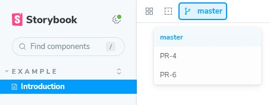

# Storybook Branch switcher

A [Storybook 7+](https://github.com/storybookjs/storybook) addon to navigate between multiple Git branches.
Also a command-line tool to automatically generate one instance per branch.



## Installation

Install the following module with npm:

```sh
npm i --save-dev storybook-branch-switcher
```

or with yarn:

```sh
yarn add -D storybook-branch-switcher
```

Then, add following content to `.storybook/main.js`

```js
module.exports = {
  addons: ["storybook-branch-switcher"],
};
```

## CLI

This package exports a script called `sb-branch-switcher` which will automatically generate one Storybook instance per
branch, based on your Git workflow. (We support Git submodules, and any checkouts will only run in a clean workspace.)

### Configuration

The CLI needs a configuration file located at `.storybook/.branches.json` by default. But you can create this file in
another location and pass the path to the CLI with the `--config` or `--c` argument.

Example : `sb-branch-switcher --config libs/storybook-host/.storybook/.branches.json`

Here is the explanation of all available options:

| Key            | Default         | Description                                                           |
| -------------- | --------------- | --------------------------------------------------------------------- |
| from           | -               | **(mandatory)** Where the Storybook instance is located after a build |
| to             | -               | **(mandatory)** Where all Storybook instances will be copied          |
| directory      | current folder  | Absolute path where the project belongs                               |
| script_name    | build-storybook | Name of the NPM script that builds the Storybook                      |
| default_branch | master          | Your default Git branch                                               |
| default_root   | true            | Copy instance for default branch into root folder                     |
| provider       | -               | Configuration to retrieve branches and commits to process             |

### With Bitbucket (opened PRs)

This provider enables you to generate one Storybook instance per opened PR of a Bitbucket repository (supports cloud and
on-premise servers).

| Key        | Default               | Description                                                |
| ---------- | --------------------- | ---------------------------------------------------------- |
| type       | -                     | **(mandatory)** must be **"bitbucket"**                    |
| project    | -                     | **(mandatory)** name of the Bitbucket project to target    |
| repository | -                     | **(mandatory)** name of the Bitbucket repository to target |
| url        | https://bitbucket.org | Bitbucket host to connect to                               |

#### Authorization (optional)

If the Bitbucket instance needs an authorization, you can use one of the following options with environment variables.

- Basic login details : `BITBUCKET_USERNAME` and `BITBUCKET_PASSWORD`
- Use an access token for HTTP Rest API: `BITBUCKET_TOKEN`

### With GitHub (opened PRs)

This provider enables you to generate one Storybook instance per opened PR of a GitHub repository.

| Key        | Default | Description                                             |
| ---------- | ------- | ------------------------------------------------------- |
| type       | -       | **(mandatory)** must be **"github"**                    |
| owner      | -       | **(mandatory)** name of the GitHub owner                |
| repository | -       | **(mandatory)** name of the Github repository to target |

You must set `GITHUB_TOKEN` environment variable to access the GitHub.com API.

### With Gitlab (opened MRs)

This provider enables you to generate one Storybook instance per opened MR in a Gitlab repository.

| Key       | Default            | Description                              |
| --------- | ------------------ | ---------------------------------------- |
| projectId | -                  | **(mandatory)** projectId of the project |
| url       | https://gitlab.com | Gitlab host to connect to                |

You must set `GITLAB_TOKEN` environment variable to access the Gitlab.com API.

### Configuration file example

```json
{
  "from": "dist/storybook",
  "to": "dist/storybook-bundle",
  "default_branch": "master",
  "default_root": true,
  "provider": {
    "type": "bitbucket",
    "project": "my-project",
    "repository": "my-design-system"
  }
}
```

## FAQ

### How do I host my storybook in a subpath? (e.g. GitHub Pages)

Out-of-the-box this addon supports hosting Storybook at the root path, but
you'll need some extra setup if you'd like to host a storybook in a subpath.

| ✅ Out-of-the-box: root path | 🛠️ Requires setup: subpaths                 |
|:-----------------------------|:--------------------------------------------|
| `http://localhost:6006`      | `http://localhost:6006/some/path`           |
| `https://sub.example.com`   | `https://your-username.github.io/your-repo` |

Just make these changes in your `.storybook/preview.js` file, in this example,
publishing to GitHub Pages.

<details>
<summary>Click for example configuration...</summary>

```diff
diff --git a/.storybook/preview.js b/.storybook/preview.js
index 6731af8..7587cb6 100644
--- a/.storybook/preview.js
+++ b/.storybook/preview.js
@@ -1,4 +1,5 @@
 /** @type { import('@storybook/react').Preview } */
 const preview = {
   parameters: {
     controls: {
@@ -10,4 +11,18 @@ const preview = {
   },
 };
 
+/* Any envvar prefixed with STORYBOOK_ will be available in the built storybook, ie. preview.js
+ * See: https://storybook.js.org/docs/configure/environment-variables
+ *
+ * Set STORYBOOK_PUBLISH_FOR_WEB=true in your build environment, along with the
+ * domain and path you'd like to host from.
+ */
+if (process.env["STORYBOOK_PUBLISH_FOR_WEB"]) {
+  preview.parameters = {
+    branches: {
+      hostname: `your-username.github.io/your-repo`,
+    }
+  }
+}
+
 export default preview;
```
</details>

You'll then just need to set `STORYBOOK_PUBLISH_FOR_WEB=true` in whatever build
environment you run the `sb-branch-switcher` command.

To test locally:
1. set `hostname` in `.storybook/preview.js` to `localhost:6006/storybook-bundle`,
2. build via `STORYBOOK_PUBLISH_FOR_WEB=true sb-branch-switcher <other opts>`
3. run `npx http-server dist` to serve your local storybook one subpath deeper.
